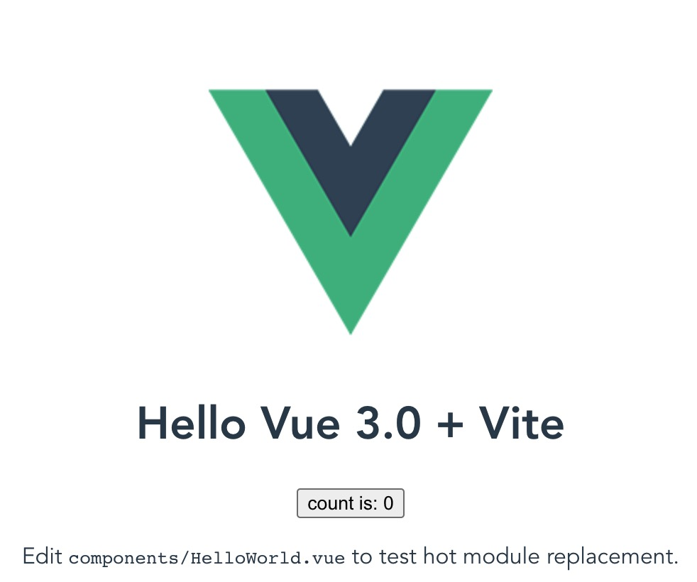
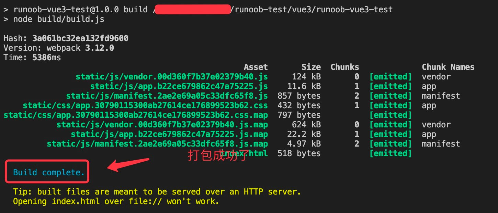
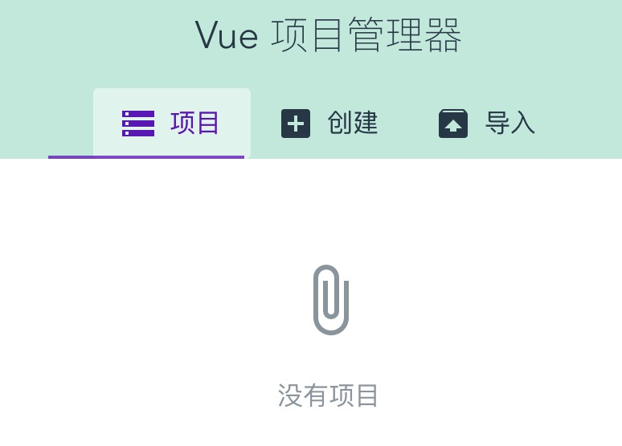
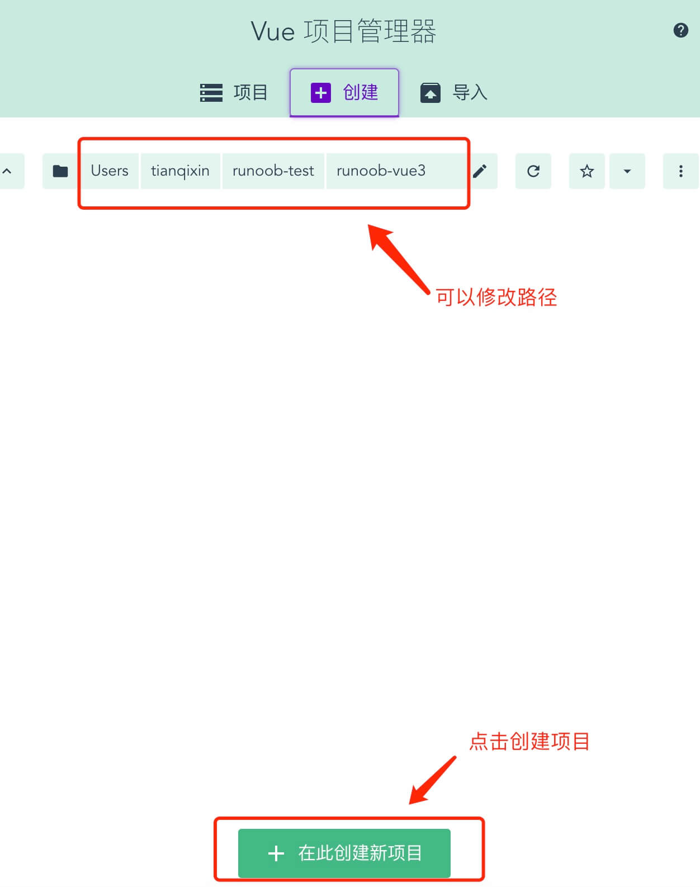

# Vue
## Vue3 安装
## 打包
1、独立版本

```
我们可以在 Vue.js 的官网上直接下载最新版本, 并用 <script> 标签引入。
```
下载 Vue.js
2、使用 CDN 方法

以下推荐国外比较稳定的两个 CDN，国内还没发现哪一家比较好，目前还是建议下载到本地。

    Staticfile CDN（国内） : https://cdn.staticfile.org/vue/3.0.5/vue.global.js

    unpkg：https://unpkg.com/vue@next, 会保持和 npm 发布的最新的版本一致。

    cdnjs : https://cdnjs.cloudflare.com/ajax/libs/vue/3.0.5/vue.global.js
```
Staticfile CDN（国内）
<div id="app">
  <p>{{ message }}</p>
</div>
```
```
unpkg（推荐）
<div id="app">
  <p>{{ message }}</p>
</div>
```
```
cdnjs
<div id="app">
  <p>{{ message }}</p>
</div>
```


3、NPM 方法

由于 npm 安装速度慢，本教程使用了淘宝的镜像及其命令 cnpm，安装使用介绍参照：使用淘宝 NPM 镜像。

npm 版本需要大于 3.0，如果低于此版本需要升级它：
```
# 查看版本
$ npm -v
2.3.0

#升级 npm
cnpm install npm -g


# 升级或安装 cnpm
npm install cnpm -g

在用 Vue.js 构建大型应用时推荐使用 cnpm 安装，cnpm 能很好地和 Webpack 或 Browserify 模块打包器配合使用：

# 最新稳定版
$ cnpm install vue@next
```
命令行工具

Vue.js 提供一个官方命令行工具，可用于快速搭建大型单页应用。

对于 Vue 3，你应该使用 npm 上可用的 Vue CLI v4.5 作为 @vue/cli。要升级，你应该需要全局重新安装最新版本的 @vue/cli：
```
# 全局安装 vue-cli
yarn global add @vue/cli
# 或
cnpm install -g @vue/cli

安装完后查看版本:

$ vue --version
@vue/cli 4.5.11

然后在 Vue 项目中运行：

vue upgrade --next

注意：vue-cli 3.x 和 vue-cli 2.x 使用了相同的 vue 命令，如果你之前已经安装了 vue-cli 2.x，它会被替换为 Vue-cli 3.x。
创建项目
```
以下实例我们使用 vue init 命令来创建一个项目：
```
$ vue init webpack runoob-vue3-test
# 这里需要进行一些配置，默认回车即可
? Project name runoob-vue3-test
? Project description A Vue.js project
? Author runoob <test@runoob.com>
? Vue build standalone
? Install vue-router? Yes
? Use ESLint to lint your code? Yes
? Pick an ESLint preset Standard
? Set up unit tests Yes
? Pick a test runner jest
? Setup e2e tests with Nightwatch? Yes
? Should we run `npm install` for you after the project has been created? (recommended) npm

   vue-cli · Generated "runoob-vue3-test".


# Installing project dependencies ...
# ========================

...

进入项目，安装并运行：

$ cd runoob-vue3-test
$ cnpm run dev
  DONE  Compiled successfully in 2558ms          

 I  Your application is running here: http://localhost:8080

成功执行以上命令后访问 http://localhost:8080/，输出结果如下所示：

    注意：Vue.js 不支持 IE8 及其以下 IE 版本。
```
Vite (推荐)

Vite 是一个 web 开发构建工具，由于其原生 ES 模块导入方式，可以实现闪电般的冷服务器启动。

通过在终端中运行以下命令，可以使用 Vite 快速构建 Vue 项目，语法格式如下：
```
npm init @vitejs/app <project-name>

创建项目 runoob-vue3-test2：

$  cnpm init @vitejs/app runoob-vue3-test2

运行项目:

$ cd runoob-vue3-test2
$ cnpm install
$ cnpm run dev
> runoob-vue3-test2@0.0.0 dev /Users/tianqixin/runoob-test/vue3/runoob-vue3-test2
> vite

[vite] Optimizable dependencies detected:
vue

  Dev server running at:
  > Local:    http://localhost:3000/

打开 http://localhost:3000/，显示如下：
```

## 打包
```
cnpm run build
```
执行以上命令，输出结果如下：


 执行完成后，会在 Vue 项目下会生成一个 dist 目录，该目录一般包含 index.html 文件及 static 目录，static 目录包含了静态文件 js、css 以及图片目录 images（如果有图片的话）。

 如果直接双击打开 index.html，在浏览器中页面可能是空白了，要正常显示则需要修改下 index.html 文件中 js、css 文件路径。

例如我们打开 dist/index.html 文件看到 css 和 js 文件路径是绝对路径：
```
<link href=/static/css/app.33da80d69744798940b135da93bc7b98.css rel=stylesheet>
<script type=text/javascript src=/static/js/app.717bb358ddc19e181140.js></script>
...
```
我们把 js、css 文件路径修改为相对路径：
```
<link href=static/css/app.33da80d69744798940b135da93bc7b98.css rel=stylesheet>
<script type=text/javascript src=static/js/app.717bb358ddc19e181140.js></script>
...
```
这样直接双击 dist/index.html 文件就可以在浏览器中看到效果了。

## Vue3 创建项目
在上一章节 Vue3 安装 我们使用了 vue init 命令创建过一个项目，本章节我们主要介绍 vue create 命令创建项目以及使用 vue ui 命令打开图形化的安装界面。

### vue create 命令
vue create 命令创建项目语法格式如下：
```
vue create [options] <app-name>
```
创建一个由 vue-cli-service 提供支持的新项目：
```
options 选项可以是：

    -p, --preset <presetName>： 忽略提示符并使用已保存的或远程的预设选项
    -d, --default： 忽略提示符并使用默认预设选项
    -i, --inlinePreset <json>： 忽略提示符并使用内联的 JSON 字符串预设选项
    -m, --packageManager <command>： 在安装依赖时使用指定的 npm 客户端
    -r, --registry <url>： 在安装依赖时使用指定的 npm registry
    -g, --git [message]： 强制 / 跳过 git 初始化，并可选的指定初始化提交信息
    -n, --no-git： 跳过 git 初始化
    -f, --force： 覆写目标目录可能存在的配置
    -c, --clone： 使用 git clone 获取远程预设选项
    -x, --proxy： 使用指定的代理创建项目
    -b, --bare： 创建项目时省略默认组件中的新手指导信息
    -h, --help： 输出使用帮助信息
```
接下来我们创建 runoob-vue3-app 项目：
```
vue create runoob-vue3-app
```
执行以上命令会出现安装选项界面：
```
Vue CLI v4.4.6
? Please pick a preset: (Use arrow keys)
❯ default (babel, eslint)
  Manually select features
```
按下回车键后就会进入安装，等候片刻即可完成安装。

安装完成后，我们进入项目目录：

cd runoob-vue3-app2

启动应用：

npm run serve

然后打开 http://localhost:8080/，就可以看到应用界面了：


## vue ui 命令

除了使用 vue create 命令创建项目，我们还可以使用可视化创建工具来创建项目。

运行命令：

```
$ vue ui
&#x1f680;  Starting GUI...
&#x1f320;  Ready on http://localhost:8000
...
```
执行以上命令，会在浏览器弹出一个项目管理的界面：

我们可以点击"创建"选项来创建一个项目，选择底部"在此创建项目"，页面上方也可以选择路径：


然后输入我们的项目名称，选择包管理工具为 npm，然后点击下一步： 
 函数在组件创建 created() 之前执行。

setup() 函数接收两个参数 props 和 context。

第一个参数 props，它是响应式的，当传入新的 prop 时，它将被更新。

第二个参数 context 是一个普通的 JavaScript 对象，它是一个上下文对象，暴露了其它可能在 setup 中有用的值。

    注意：在 setup 中你应该避免使用 this，因为它不会找到组件实例。setup 的调用发生在 data property、computed property 或 methods 被解析之前，所以它们无法在 setup 中被获取。

以下实例使用组合 API 定义一个计数器：
实例（src/APP.vue）
```
<template>
    <div>
        <p>计数器实例: {{ count }}</p>
        <input @click="myFn" type="button" value="点我加 1">
    </div>
</template>

<script>
import {ref, onMounted} from 'vue';

export default {
    setup(){
        //定义初始值为0的变量，要使用ref方法赋值，直接赋值的话变量改变不会更新 UI
        let count = ref(0);

        // 定义点击事件 myFn
        function myFn(){
            console.log(count);
            count.value += 1;
        }
       
       // 组件被挂载时，我们用 onMounted 钩子记录一些消息
        onMounted(() => console.log('component mounted!'));

        // 外部使用组合API中定义的变量或方法，在模板中可用。
        return {count,myFn} // 返回的函数与方法的行为相同
    }
}
</script>
```
在 Vue 3.0 中，我们可以通过一个新的 ref 函数使任何响应式变量在任何地方起作用，如下所示：
```
import { ref } from 'vue'

let count = ref(0);

ref() 函数可以根据给定的值来创建一个响应式的数据对象，返回值是一个对象，且只包含一个 .value 属性。

在 setup() 函数内，由 ref() 创建的响应式数据返回的是对象，所以需要用 .value 来访问。
实例
import { ref } from 'vue'

const counter = ref(0)

console.log(counter) // { value: 0 }
console.log(counter.value) // 0

counter.value++
console.log(counter.value) // 1
Vue 组合式 API 生命周期钩子

在 Vue2 中，们通过以下方式实现生命周期钩子函数：
实例
export default {
  beforeMount() {
    console.log('V2 beforeMount!')
  },
  mounted() {
    console.log('V2 mounted!')
  }
};

在 Vue3 组合 API 中实现生命周期钩子函数可以在 setup() 函数中使用带有 on 前缀的函数：
实例
import { onBeforeMount, onMounted } from 'vue';
export default {
  setup() {
    onBeforeMount(() => {
      console.log('V3 beforeMount!');
    })
    onMounted(() => {
      console.log('V3 mounted!');
    })
  }
};

下表为 Options API 和 Composition API 之间的映射，包含如何在 setup () 内部调用生命周期钩子：
Vue2 Options-based API	Vue Composition API
beforeCreate	setup()
created	setup()
beforeMount	onBeforeMount
mounted	onMounted
beforeUpdate	onBeforeUpdate
updated	onUpdated
beforeDestroy	onBeforeUnmount
destroyed	onUnmounted
errorCaptured	onErrorCaptured

因为 setup 是围绕 beforeCreate 和 created 生命周期钩子运行的，所以不需要显式地定义它们。换句话说，在这些钩子中编写的任何代码都应该直接在 setup 函数中编写。

这些函数接受一个回调函数，当钩子被组件调用时将会被执行:
实例
setup() {
...
    // 组件被挂载时，我们用 onMounted 钩子记录一些消息
    onMounted(() => console.log('component mounted!'));
...
}
模板引用

在使用组合式 API 时，响应式引用和模板引用的概念是统一的。

为了获得对模板内元素或组件实例的引用，我们可以像往常一样声明 ref 并从 setup() 返回：
实例
<template>
  <div ref="root">This is a root element</div>
</template>

<script>
  import { ref, onMounted } from 'vue'

  export default {
    setup() {
      const root = ref(null)

      onMounted(() => {
        // DOM 元素将在初始渲染后分配给 ref
        console.log(root.value) // <div>This is a root element</div>
      })

      return {
        root
      }
    }
  }
</script>

以上实例中我们在渲染上下文中暴露 root，并通过 ref="root"，将其绑定到 div 作为其 ref。

作为模板使用的 ref 的行为与任何其他 ref 一样：它们是响应式的，可以传递到 (或从中返回) 复合函数中。
v-for 中的用法

组合式 API 模板引用在 v-for 内部使用时没有特殊处理。相反，请使用函数引用执行自定义处理：
实例
<template>
  <div v-for="(item, i) in list" :ref="el => { if (el) divs[i] = el }">
    {{ item }}
  </div>
</template>

<script>
  import { ref, reactive, onBeforeUpdate } from 'vue'

  export default {
    setup() {
      const list = reactive([1, 2, 3])
      const divs = ref([])

      // 确保在每次更新之前重置ref
      onBeforeUpdate(() => {
        divs.value = []
      })

      return {
        list,
        divs
      }
    }
  }
</script>
侦听模板引用

侦听模板引用的变更可以替代前面例子中演示使用的生命周期钩子。

但与生命周期钩子的一个关键区别是，watch() 和 watchEffect() 在 DOM 挂载或更新之前运行会有副作用，所以当侦听器运行时，模板引用还未被更新。
实例
<template>
  <div ref="root">This is a root element</div>
</template>

<script>
  import { ref, watchEffect } from 'vue'

  export default {
    setup() {
      const root = ref(null)

      watchEffect(() => {
        // 这个副作用在 DOM 更新之前运行，因此，模板引用还没有持有对元素的引用。
        console.log(root.value) // => null
      })

      return {
        root
      }
    }
  }
</script>

因此，使用模板引用的侦听器应该用 flush: 'post' 选项来定义，这将在 DOM 更新后运行副作用，确保模板引用与 DOM 保持同步，并引用正确的元素。
实例
<template>
  <div ref="root">This is a root element</div>
</template>

<script>
  import { ref, watchEffect } from 'vue'

  export default {
    setup() {
      const root = ref(null)

      watchEffect(() => {
        console.log(root.value) // => <div>This is a root element</div>
      },
      {
        flush: 'post'
      })

      return {
        root
      }
    }
  }
</script>
```

